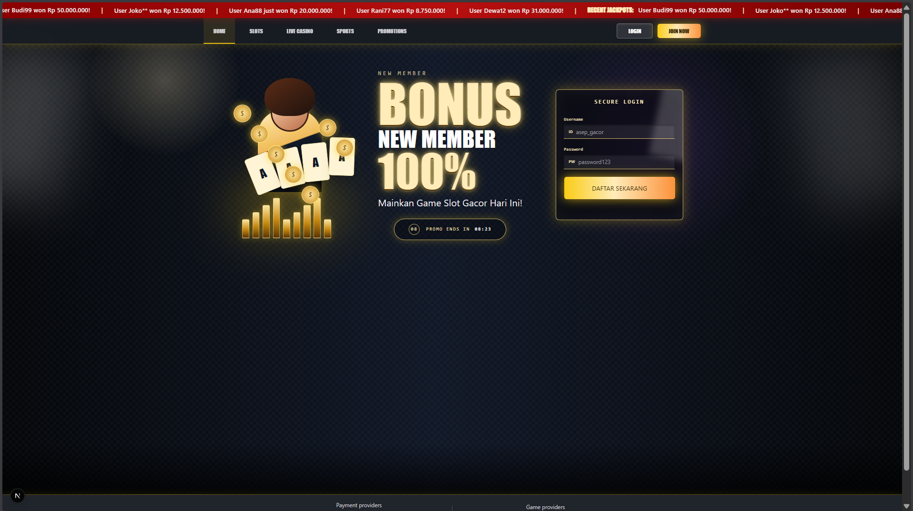



# 🎰 Neon Stakes
**Studi Kasus Edukasi: Simulator Betting, UI/UX 'Dark Patterns', & Concurrency System**

 

> ⚠️ **PERINGATAN EDUKASI & DISCLAIMER**
> Project ini dibuat murni **untuk tujuan riset dan edukasi software engineering**. **TIDAK ADA** transaksi uang asli, payment gateway, maupun nilai ekonomi beneran di sini. Semua balance (saldo) cuma simulasi. *Neon Stakes* ini dibuat buat ngebedah cara kerja sistem transaksional yang aman (concurrency), teori probabilitas dasar, dan ngebahas soal *Dark Patterns* (trik psikologis UI/UX) yang sering dipakai di aplikasi serupa.

---

## 📸 Tampilan UI

| Login & Register | Player Dashboard |
|:---:|:---:|
|  |  |

| Tampilan Slot Machine | Ruang Kontrol Admin |
|:---:|:---:|
|  |  |

---

## 🏗️ Arsitektur Sistem

Konsep utama di arsitektur ini adalah **"Zero Client Trust"**. Di aplikasi keuangan atau betting apapun, frontend / sisi client sama sekali nggak boleh punya akses buat nentuin hasil, menang/kalah, atau apalagi ngedit saldo.

`mermaid
graph TD
    Client[Next.js Client] -.->|HTTP POST /api/spin| Gateway(API Gateway)
    
    subgraph "Backend Tertutup (Go & PostgreSQL)"
        Gateway --> Auth[Middleware RBAC]
        Auth --> RNG[Engine PRNG (Golang)]
        RNG --> Ledger[Sistem Transaksi]
        Ledger -->|SELECT ... FOR UPDATE| DB[(Supabase PostgreSQL)]
    end
    
    DB -->|State Baru| Ledger
    Ledger -->|Hasil Spin + Update Saldo| Client
    
    style Client fill:#2d3748,stroke:#4a5568,color:#fff
    style Gateway fill:#2b6cb0,stroke:#2c5282,color:#fff
    style Auth fill:#319795,stroke:#285e61,color:#fff
    style RNG fill:#805ad5,stroke:#553c9a,color:#fff
    style Ledger fill:#c53030,stroke:#9b2c2c,color:#fff
    style DB fill:#2f855a,stroke:#276749,color:#fff
`

**Alur Permainan:**
1. Frontend murni cuma ngerender *animasi* (kayak efek roda berputar) berdasarkan respons JSON dari server.
2. Backend (Go) jadi pemegang **otoritas mutlak** buat nge-generate angka acak (PRNG) dan update *state* dompet di database.

---

## 🚀 Sorotan Teknis

### 1. Menjaga Integritas Data (Mencegah Race Condition)
Biar user nggak bisa nge-bug sistem dengan *double-spending* (misal klik tombol spin cepat-cepat pakai script), kita implementasiin **Pessimistic Locking** (SELECT ... FOR UPDATE) di level database transaction.
Jadi kalau ada dua request berbarengan di jeda beberapa milidetik, transaksi kedua bakal dipaksa nunggu transaksi pertama kelar ngurangin saldo, baru dia bisa jalan. Nggak bakal ada saldo minus atau ke-spin gratis.

### 2. Logika Matematika (The House Edge)
Algoritma peluang di sini di-setting buat ngasilin **RTP (Return to Player) 96.5%**, yang artinya *House Edge* atau jatah untungnya sistem ada di **3.5%**.

} \text{RTP} = \left( \frac{\text{Total Hadiah (Payout)}}{\text{Total Taruhan (Bet)}} \right) \times 100\% }

Sistem nggak perlu di-setting manual atau "dicurangi" kalau lagi rugi. Margin keuntungan ini udah ke-lock secara matematis pakai *Weighted PRNG* dari pembobotan simbol dan paylines yang ada.

### 3. Sisi Psikologis (UI/UX Dark Patterns)
- **Algoritma "Near-Miss"**: Waktu sistem udah nentuin kalau player bakal kalah, ada probabilitas **30%** UI bakal nampilin efek "nyaris menang" (misal: dua simbol Jackpot udah pas, eh simbol ketiganya kelewat satu kotak doang). Di realitanya ini tetap kalah telak, tapi efek visual ini didesain buat ngakalin psikologis (dopamin) biar player penasaran dan nge-spin lagi.
- **Sensory Overload**: Kita pakai animasi partikel (Framer Motion) dan efek suara yang heboh, padahal kadang player cuma menang receh (dapatnya lebih kecil dari modal spin).

### 4. Role-Based Access Control (RBAC)
Ada pemisahan *Role* jelas via JWT. Player biasa cuma bisa masuk ke <PlayerLobby>, sedangkan akun spesifik bisa akses <AdminDashboard> buat mantau *financial exposure* (Total keuntungan bandar, RTP harian secara *real-time*, dan flow saldo masuk).

---

## 🗄️ Skema Database

Struktur inti di **PostgreSQL**:

`sql
-- TABEL USERS
CREATE TABLE users (
    id UUID PRIMARY KEY DEFAULT uuid_generate_v4(),
    email VARCHAR(255) UNIQUE NOT NULL,
    role VARCHAR(50) DEFAULT 'PLAYER' CHECK (role IN ('PLAYER', 'ADMIN')),
    created_at TIMESTAMP WITH TIME ZONE DEFAULT NOW()
);

-- TABEL WALLET (DOMPET)
CREATE TABLE wallets (
    user_id UUID PRIMARY KEY REFERENCES users(id) ON DELETE CASCADE,
    balance DECIMAL(15, 2) NOT NULL DEFAULT 1000.00,
    currency VARCHAR(10) DEFAULT 'IDR',
    updated_at TIMESTAMP WITH TIME ZONE DEFAULT NOW()
);

-- TABEL HISTORY TARUHAN (BET LOGS)
CREATE TABLE bet_logs (
    id UUID PRIMARY KEY DEFAULT uuid_generate_v4(),
    user_id UUID REFERENCES users(id),
    bet_amount DECIMAL(15, 2) NOT NULL,
    payout_amount DECIMAL(15, 2) NOT NULL,
    result_pattern JSONB NOT NULL, -- Nyimpen posisi simbol waktu berhenti
    is_near_miss BOOLEAN DEFAULT FALSE,
    created_at TIMESTAMP WITH TIME ZONE DEFAULT NOW()
);
`

---

## 🛠️ Cara Setup & Run Project

### 1. Backend (Golang)
Backend ini yang ngurus logika JWT, peluang (RTP), RNG, dan koneksi ke database.
`ash
cd server
# Copy template .env
cp .env.example .env
# Isi string koneksi Supabase/PostgreSQL kamu di .env

# Download module
go mod tidy

# Jalankan server lokal
go run main.go
`
*(Jangan lupa pastiin database PostgreSQL/Supabase kamu udah nyala dan bisa diakses)*

### 2. Frontend (Next.js)
Frontend pakai Next.js App Router dan di-styling pakai Tailwind CSS.
`ash
cd client
# Install dependencies
npm install

# Jalankan dev server
npm run dev
# Kalau pakai Windows, bisa pakai script ini juga:
./dev-server.ps1
`
Tinggal buka http://localhost:3000 di browser.

---

## 📊 Insight Edukasi: Volatilitas vs Hukum Bilangan Besar

Banyak yang mikir kalau jadi bandar itu "pasti untung detik itu juga". Realitas secara matematika berpusat pada **Hukum Bilangan Besar (The Law of Large Numbers)**.

**Kenapa bandar bisa rugi di jangka pendek?**
Kalau data sampelnya masih dikit (misal baru ada ~100 spin), efek **Volatilitas / Varians** itu gede banget. Bisa aja ada player yang baru main sekali langsung kena jackpot, bikin diagram *profit* sistem langsung anjlok jadi minus.

**Kepastian di Jangka Panjang**
Tapi, kalau skala pelayanannya udah jutaan putaran dari banyak pemain berbarengan, probabilitas riilnya bakal nyaru ke angka teori:
} P(E) \rightarrow \text{True Mathematical Probability} }
Volatilitas harian ini lama-lama bakal ketutup, dan ujung-ujungnya rata-rata keuntungan sistem (*Net Margin*) bakal selalu tertarik mendekat ke angka pasti **+3.5%**.

Makanya, tantangan utama bikin sistem kayak gini tuh bukan pusing gimana cari cara ngakalin hasil per satu pemain, tapi **gimana caranya ngebangun backend yang kuat nerima ribuan request per detik (RPS) tanpa ada satupun data transaksi atau saldo dompet yang bocor**, apalagi nembus jadi saldo minus (*Zero Race Conditions*).

 

---

  Dibangun untuk studi kasus engineering oleh tim Neon Stakes.

