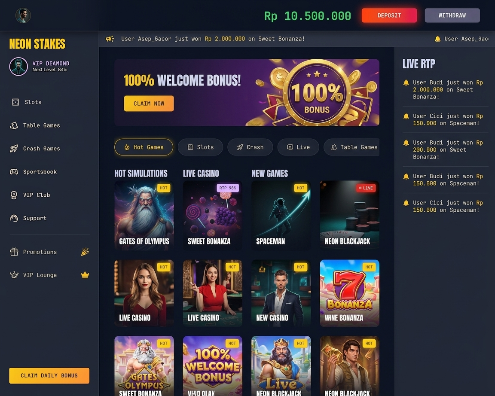
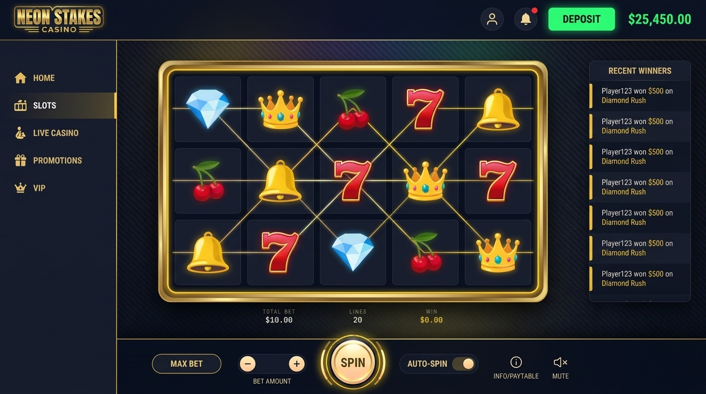

<div align="center">

# 🎰 Neon Stakes
**Studi Kasus Edukasi: Simulator Perjudian, Pola Gelap UI/UX, & Sistem Transaksional Konkurensi Tinggi**


</div>

<br/>

> ⚠️ **PERINGATAN EDUKASI & DISCLAIMER**
> Proyek ini dikembangkan secara **eksklusif untuk tujuan edukasi dan riset perangkat lunak**. **TIDAK ADA** transaksi uang sungguhan, gerbang pembayaran, atau nilai ekonomi nyata dalam sistem ini. Semua saldo bersifat simulasi. *Neon Stakes* dirancang sebagai sarana pembelajaran untuk memahami rekayasa perangkat lunak sistem transaksional yang aman, teori probabilitas, dan analisis psikologis dari *Dark Patterns* (Pola Gelap) pada UI/UX.

---

## 📸 Pratinjau Visual (UI/UX)

| Autentikasi & Registrasi | Dasbor Pemain (Lobby) |
|:---:|:---:|
|  |  |

| Antarmuka Mesin Slot | Ruang Kontrol Admin (Eksposur Finansial) |
|:---:|:---:|
|  |  |

---

## 🏗️ Arsitektur Sistem

Proyek ini dibangun dengan mendokumentasikan paradigma **"Zero Client Trust"** (Kepercayaan Klien Nol). Dalam aplikasi taruhan atau finansial, antarmuka klien (Frontend) tidak boleh memiliki otoritas untuk menentukan hasil perhitungan, status menang/kalah, atau memanipulasi saldo.

```mermaid
graph TD
    Client[Next.js Client] -.->|HTTP POST /api/spin| Gateway(API Gateway)
    
    subgraph "Server Tertutup (Go & PostgreSQL)"
        Gateway --> Auth[Middleware RBAC]
        Auth --> RNG[Engine PRNG (Golang)]
        RNG --> Ledger[Sistem Transaksi]
        Ledger -->|SELECT ... FOR UPDATE| DB[(Supabase PostgreSQL)]
    end
    
    DB -->|State Baru| Ledger
    Ledger -->|Hasil Spin + Delta Saldo| Client
    
    style Client fill:#2d3748,stroke:#4a5568,color:#fff
    style Gateway fill:#2b6cb0,stroke:#2c5282,color:#fff
    style Auth fill:#319795,stroke:#285e61,color:#fff
    style RNG fill:#805ad5,stroke:#553c9a,color:#fff
    style Ledger fill:#c53030,stroke:#9b2c2c,color:#fff
    style DB fill:#2f855a,stroke:#276749,color:#fff
```

**Siklus Hidup Permainan:**
1. Frontend murni hanya menangani *determinasi animasi* (seperti efek putaran roda berdasar respons dari server).
2. Backend (Go) memegang **otoritas absolut** atas mutasi *state* dan penghasil bilangan acak buatan (PRNG).

---

## 🚀 Sorotan Teknis Inti

### 1. Integritas Database (Race Condition Mitigation)
Untuk mencegah *double-spending* (saldo digunakan untuk beberapa spin serentak), sistem menggunakan **Pessimistic Locking** (`SELECT ... FOR UPDATE`) dalam batas *Database Transaction*.
Jika `Player A` mengklik tombol putar dua kali dalam jeda 5ms, transaksi pertama akan mengunci baris dompet, sehingga transaksi kedua harus menunggu hingga yang pertama selesai dan memperbarui sisa saldo.

### 2. Logika Matematis (The House Edge)
Algoritma simulasi peluang ini dirancang menghasilkan **RTP (Return to Player) sebesar 96.5%** yang setara dengan **House Edge 3.5%**. 

$$ \text{RTP} = \left( \frac{\text{Total Hadiah yang Dikembalikan}}{\text{Total Taruhan yang Masuk}} \right) \times 100\% $$

Sistem tidak mengandalkan "pengaturan manual jika bandar rugi". Margin keuntungan bandar sudah tertanam secara *hard-coded* melalui rasio bobot probabilitas (Weighted PRNG) dari simbol dan *paylines*.

### 3. Mesin Gamifikasi Psikologis (Dark Patterns)
- **Near-Miss Algorithm**: Saat sistem menetapkan pemain kalah (`Lose`), ada kemungkinan **30%** bahwa UI akan diinstruksikan merender "nyaris menang" (misal: dua simbol Jackpot sejajar, dengan simbol ketiga terpeleset satu slot). Secara matematis ini adalah kekalahan 100%, tetapi secara psikologis merangsang dopamin dan retensi perputaran pemain.
- **Sensory Overload**: Penggunaan partikel kemenangan (Framer Motion) dan transisi suara secara berlebihan walau untuk kemenangan mikroskopis (menang lebih kecil dari nilai taruhan).

### 4. Role-Based Access Control (RBAC)
Sistem memisahkan akses via *Claims* dari JWT, mengarahkan antara rute `<PlayerLobby>` dan `<AdminDashboard>`. Admin secara instan dapat melihat eksposur finansial (Total Rake, RTP riil harian, dan GGR - *Gross Gaming Revenue*).

---

## 🗄️ Skema Database

Implementasi dasar pada **PostgreSQL**:

```sql
-- TABEL PENGGUNA
CREATE TABLE users (
    id UUID PRIMARY KEY DEFAULT uuid_generate_v4(),
    email VARCHAR(255) UNIQUE NOT NULL,
    role VARCHAR(50) DEFAULT 'PLAYER' CHECK (role IN ('PLAYER', 'ADMIN')),
    created_at TIMESTAMP WITH TIME ZONE DEFAULT NOW()
);

-- TABEL DOMPET (WALLET)
CREATE TABLE wallets (
    user_id UUID PRIMARY KEY REFERENCES users(id) ON DELETE CASCADE,
    balance DECIMAL(15, 2) NOT NULL DEFAULT 1000.00,
    currency VARCHAR(10) DEFAULT 'IDR',
    updated_at TIMESTAMP WITH TIME ZONE DEFAULT NOW()
);

-- TABEL CATATAN TARUHAN (BET LOGS)
CREATE TABLE bet_logs (
    id UUID PRIMARY KEY DEFAULT uuid_generate_v4(),
    user_id UUID REFERENCES users(id),
    bet_amount DECIMAL(15, 2) NOT NULL,
    payout_amount DECIMAL(15, 2) NOT NULL,
    result_pattern JSONB NOT NULL, -- Menyimpan status array/posisi simbol
    is_near_miss BOOLEAN DEFAULT FALSE,
    created_at TIMESTAMP WITH TIME ZONE DEFAULT NOW()
);
```

---

## 🛠️ Panduan Instalasi & Eksekusi

### 1. Menjalankan Backend (Golang)
Backend menangani logika enkripsi JWT, RTP RNG, dan interaksi Database.
```bash
cd server
# Salin konfigurasi environment
cp .env.example .env
# Isi string koneksi Supabase Pooler di .env (contoh: DATABASE_URL=postgres://...)

# Install dependensi module
go mod tidy

# Jalankan server lokal
go run main.go
```
*Pastikan daemon database Anda (PostgreSQL/Supabase) aktif.*

### 2. Menjalankan Frontend (Next.js)
Frontend dikembangkan dengan Next.js App Router dan antarmuka berbasis Tailwind CSS.
```bash
cd client
# Instal seluruh paket NPM
npm install

# Jalankan development server
npm run dev
# Atau khusus Windows dev (menggunakan PowerShell script bawaan)
./dev-server.ps1
```
Buka `http://localhost:3000` di peramban Anda.

---

## 📊 Insight Edukasi: Varians & Hukum Bilangan Besar

Banyak insinyur pemula yang berekspektasi bahwa bandar (The House) akan selalu "menang di setiap detiknya". Fakta matematisnya berpusat pada **Hukum Bilangan Besar (The Law of Large Numbers)**.

**Mengapa Kasino Bisa Rugi Jangka Pendek?**
Dalam ukuran sampel kecil (~100 putaran beruntun), **Varians** memegang kendali penuh. Seorang pemain bisa mendapatkan *Jackpot* dengan taruhan pertama mereka, menyebabkan *House Profit* berubah tajam menjadi negatif.

**Kepastian Jangka Panjang**
Jika sampel dilebarkan hingga jutaan putaran pemain serentak (High-Concurrency):
$$ P(E) \rightarrow \text{True Mathematical Probability} $$
Volatilitas harian akan teredam dan rata-rata bersih (Net Margin) akan selalu tertarik mendekati **+3.5%**. 
Itulah mengapa fokus utama dari simulasi kasino skala besar bukanlah pada *mengakali* hasil 1-2 pemain, namun **merekayasa sistem agar tahan melayani ribuan RPS (Requests Per Second) tanpa satupun data dompet terkorupsi (Zero Race Conditions).**

<br/>

---
<div align="center">
  <sub>Dibangun dengan dedikasi rekayasa oleh tim Neon Stakes.</sub>
</div>
